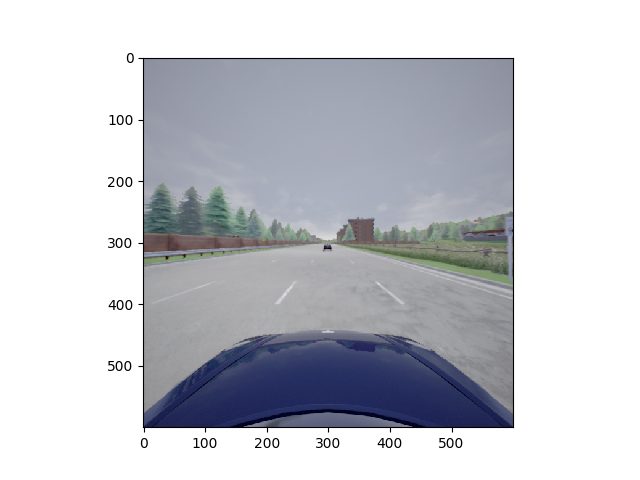
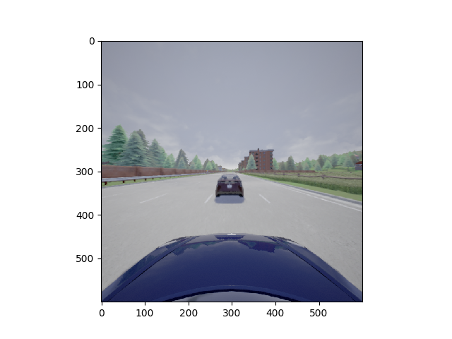
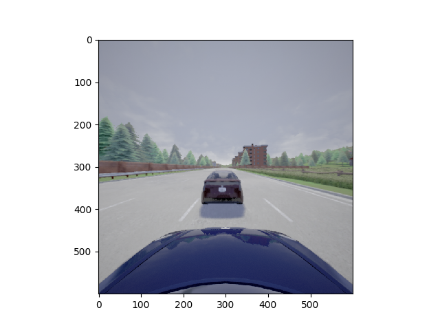

Mini-Project 1b: Perception-based Control
=========================================

## Overview

In this part of the mini-project, we will estimate the distance between the host car and
the lead car from video data and pass these estimated values to the ACC module created
in MP1 Part A.

The video data is already passed into file `predictor.py`. The image at each frame is a numpy array of size (600,600,3). Here are three examples:
<!--  {:height="36px" width="36px"} -->
<p align="center">

</p>

The code for visualizing the image is in the file `mp1_simulator/__main__.py` at `line 92`.
You could even try to build a new dataset specifically for carla environment.

The basic operation of ACC is as follows: the driver sets a cruising speed reference
`vref_host` that is assumed to be constant across this experiment. If the distance
between the host car and the lead car is greater than `dSafe`, then the host car
attempts to travel at the driver-set cruising speed. If the distance between the host
car and the lead car is less than `dSafe`, then the host car tries to maintain at least
the safe distance `dSafe` from the lead car.

The inputs to the ACC are the driver-set reference for the host car, the estimated
distance between the lead car and the host car, and the host car's velocity. The output
of the ACC-based controller the acceleration value for the host car.

## Task

You are given a project with the structure 
```
csci513-miniproject1a                   # root directory
  ├── Carla.Dockerfile                  # Dockerfile to set up the CARLA simulator
  ├── Makefile                          # Makefile to easily run things
  ├── mp1_controller
  │  ├── __init__.py
  │  └── controller.py                  # The file your edited in Part A
  ├── mp1_distance_predictor
  │  ├── __init__.py
  │  └── predictor.py                   # THE FILE YOU NEED TO EDIT
  ├── mp1_simulator
  │  ├── __init__.py
  │  ├── __main__.py                    # The test runner
  │  ├── misc.py
  │  ├── render.py
  │  └── simulator.py                   # An interface to the simulator
  ├── pyproject.toml
  ├── README.md
  ├── setup.cfg
  ├── setup.py
```

As you can see, most of the files remain the same as in the previous part. The main file
you need to edit is `mp1_distance_predictor/predictor.py`, which is there the distance
predictor skeleton is provided. 

In each step of the simulation, the simulator will take the data from the camera sensor
on-board the ego car, and pass it onto your predictor module. Here, the goal is for you
to train a Neural Network model that can take this image, and predict the distance to
the lead car.

The predicted distance is then passed back to the controller you designed in Part A to
safely control the adaptive cruise controller.

## Setup

In all instances you need to have the following prerequisite packages installed:

1. Python 3.8
2. Pip >= 21

Use the same setup as in Part A for CARLA.

From the current project directory, run

```shell
$ pip install -e .
```
This command will install the project dependencies, and allow you to run the simulations
easily.

## Designing the neural network

The choice of design for the neural network, including the framework to use, is left to
you. The NN should take an image as input (an `np.ndarray` of size `600 x 600`), and
return a distance as an output (`float`).

**NOTE:** Tensorflow has issues where it allocates too much memory on the GPU, and this can
cause both, Tensorflow _and_ CARLA to hang.

Some resources:

- [Deep Learning In 60
  Minutes](https://pytorch.org/tutorials/beginner/deep_learning_60min_blitz.html)
- [Training an Object
  Detector](https://www.pyimagesearch.com/2021/11/01/training-an-object-detector-from-scratch-in-pytorch/)


## Training the neural network

For this part of the project you will need to use a dataset to train your neural network
to predict distances. We recommend using the
[KITTI](http://www.cvlibs.net/datasets/kitti/) to train the distance predictor. If you
are using PyTorch, the easiest way to get started is by using
[`torchvision.datasets`](https://pytorch.org/vision/stable/datasets.html#kitti).
Otherwise, if you're using Tensorflow, you can use
[`tfds.object_detection.Kitti`](https://www.tensorflow.org/datasets/catalog/kitti).

Otherwise, the [KITTI MoSeg](http://webdocs.cs.ualberta.ca/~vis/kittimoseg/) dataset is
a great, low download size, alternative to the above methods. In this case, note that
each .png file in the images folder corresponds to a video frame. We recommended using
one of the following videos for training (but feel free to use other videos in the
dataset): `2011_09_26_drive_0018`, `2011_09_26_drive_0057`, `2011_09_26_drive_0059`.


If you need any pointers in getting started with the design/training of the NN, feel
free to contact Anand on Slack.

### Minor issues you may run into

1. The camera information doesn't match due to positioning of the simulated camera:

   To fix this, play around with the `CAMERA_POSITION` dictionary in
   `./mp1_simulator/simulator.py` (line 32).

## Running the simulations.


1. Start Carla, either from a terminal window (using Docker or otherwise) or by simply
   launching the CarlaUE4 executable.

2. In the other terminal, start the controller:
```shell
$ python3 -m mp1_simulator --n-episodes 10
```

You can also run the following to see what options you have for the test runner. 
```shell
$ python3 -m mp1_simulator --help
```

When you run the script, for every episode run by the script, it will save a CSV file in
the `log/` directory. These CSV files (or _traces_) are a recording of the simulation
consisting of only the state variables we deem necessary for evaluating your design.

## Evaluating your design

In this assignment, we will use Signal Temporal Logic (STL) requirements to ensure the
correctness of the controller. To do this, we use the [RT-AMT][rtamt] package (installed
automatically) to define offline monitors for your controller.

[rtamt]: https://github.com/nickovic/

To evaluate the traces you've captured for your controller, simply run the following
command:
```shell
$ python3 -m mp1_evaluation <list of log files>
```
where `<list of log files>` is a placeholder for all the CSV files you need to evaluate.
An example (assuming you are saving the files in `log/` directory) would be:
```shell
$ python3 -m mp1_evaluation log/*
```
which will evaluate all the files in that directory.
